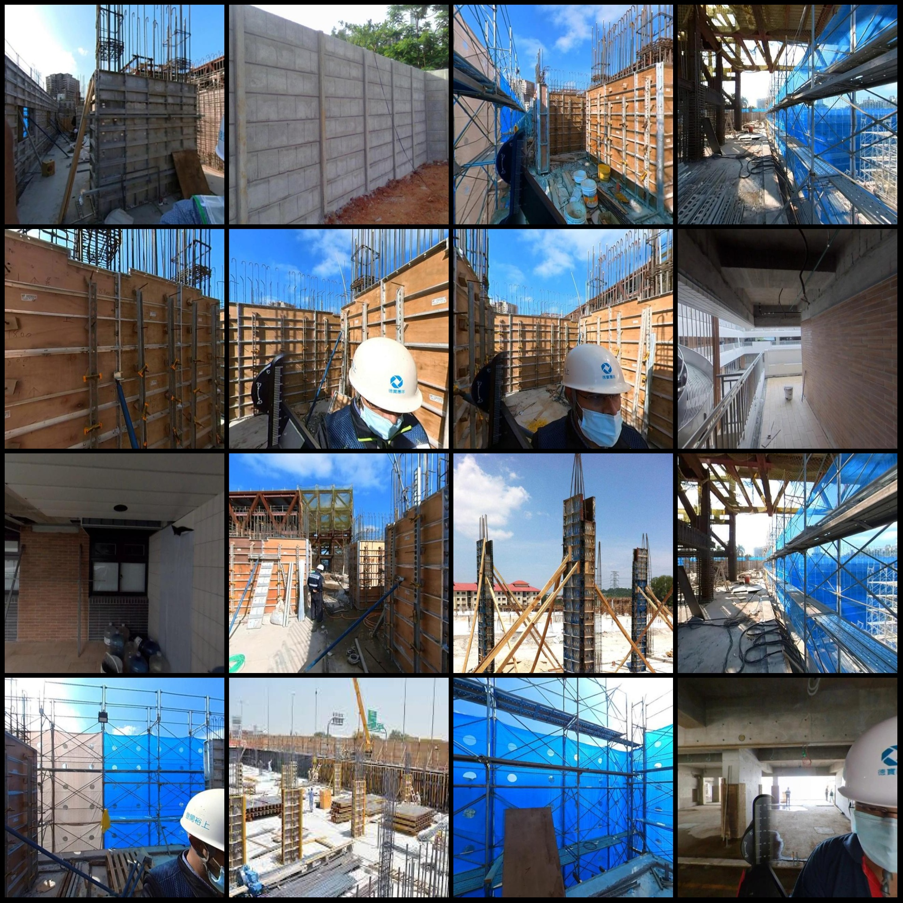
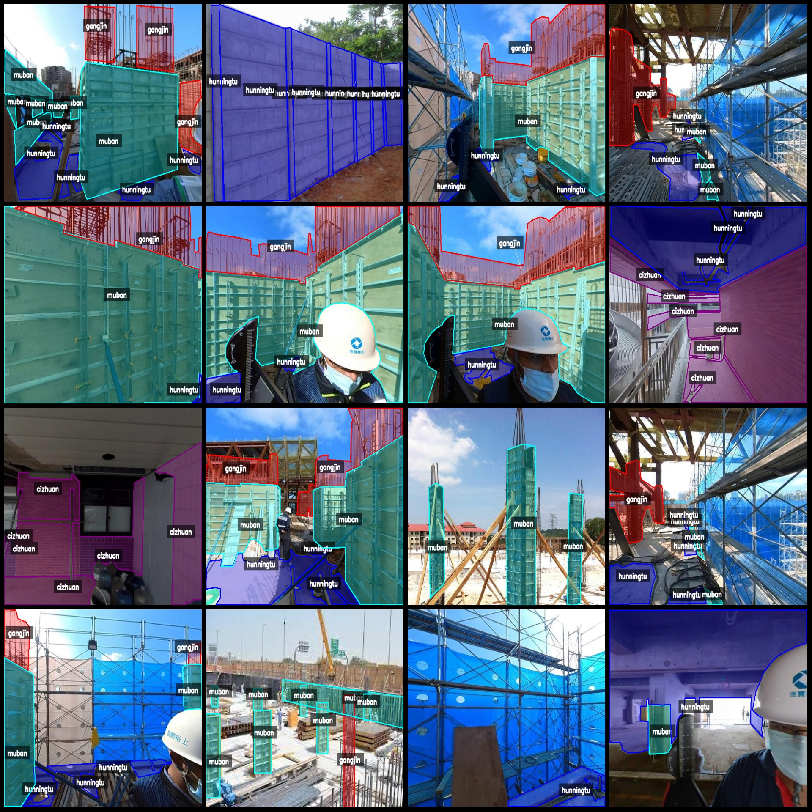
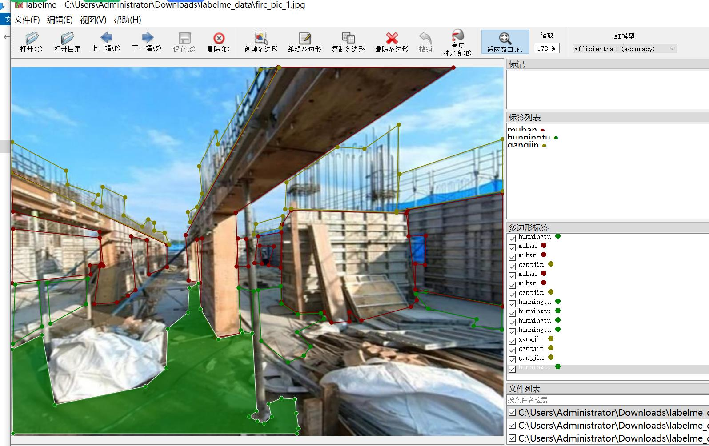

# Smart Construction Element Identification: Recognizing Rebar, Concrete, Tile, and Temporary Materials in JPG Images
Dataset format: LabelMe (excluding mask files, containing only JPG images and corresponding JSON files)
Number of images: 1185 JPG files
Number of annotations: 1185 JSON files
Number of categories: 4
Annotation categories: ["cizhuan", "gangjin", "hunningtu", "muban"]
Box count for each category:
- Cizhuan (Tile): count = 1798
- Gangjin (Rebar): count = 1963
- Hunningtu (Concrete): count = 3250
- Muban (Temporary Materials): count = 1556
Total box count: 8567
Labeling tool used: LabelMe v5.5.0
Image resolution: 640x480
Annotation rules: Polygons are drawn around the categories.
Important Note: The dataset can be opened and edited using LabelMe; JSON datasets need to be converted into either Yolo or COCO format for semantic segmentation or instance segmentation.
Special Disclaimer: This dataset does not guarantee the accuracy of the trained models or weight files.
Image previews:

Annotation example:
Original images (choose 16 randomly):
Annotation drawing results:
LabelMe editing image examples:

## Images

Here is a pay link on Stripe ( https://buy.stripe.com/3cs8yP7sY87d0vu9AB ). Please contact me lonlonago@foxmail.com after funding $89, and I will send you a complete data files , thank you!

